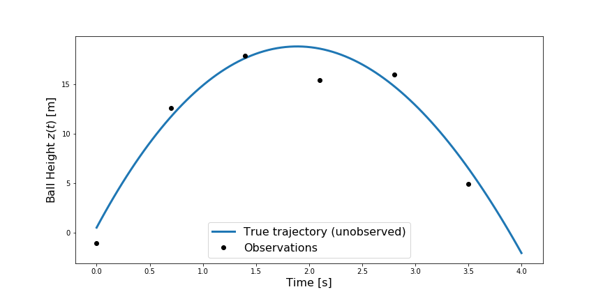

# Solution to the Multivariate Gaussian and Monte Carlo Problem Set

#### Question 1. Gaussian Inference for Baseball Velocities

In this problem, we consider the height of a baseball after it has been hit by a bat.  Let $t=0$ denote the time just after the ball leaves the bat.  We assume that both the initial position and velocity of the ball are unknown.  We restrict our attention to the vertical position and velocity of the ball and aim to infer the initial position $z_0=z(t=0)$ and initial velocity $v_0=v(t=0)$ using observations of the ball height over time.  

Ignoring drag (for now at least) and using Newton's second law, the height of the ball as a function of time is given by

$$
z(t)= z_0 + v_0t - \frac{1}{2}gt^2,
$$

where $g=9.81\, m/s^2$ is the acceleration due to gravity.  The initial height $z_0$ and vertical velocity $v_0$ are unknown parameters in this model that we will treat as Gaussian random variables.

In this problem, we will assume we have $N$ noisy observations of $z(t)$ at times $t_1,t_2,\ldots,t_N$ after the baseball leaves the bat.  The major league baseball "Statcast" system uses 3d cameras to measure the location of the ball and estimate its initial velocity and trajectory.   Here we will assume that we do not have high speed cameras measuring the ball kinematics immediately after impact, but instead have a less expensive system that produces noisy measurements of the ball's height over its entire trajectory, as shown below.

Let $\mathbf{z}$ denote the the vector of noisy observations, which we assume relates to our model predictions through

$$
\mathbf{z}= \left[ \begin{array}{c} z(t_1)\\ \vdots\\  z(t_N)\end{array} \right] + \epsilon,
$$

where $\epsilon\sim N(0,\sigma_\epsilon^2I)$ is an $N$-dimensional Gaussian random variable with zero mean and diagonal covariance $\sigma_\epsilon^2=3$.   The observation times and heights are

| $t_i$| $z(t_i)$ |
|------|----------|
| 0.0  |  0.93    |
| 0.7  |  7.43    |
| 1.4  |  19.33   |
| 2.1  |  18.46   |
| 2.8  |  13.10   |
| 3.5  |  5.45    |

### Task 1:
Use the parabolic model defined above to construct a matrix $A$ and vector $b$ such that
$$
\mathbf{z}=A\left[\begin{array}{c}z_0\\ v_0\end{array}\right] + b + \epsilon
$$
Express these matrices and vectors in terms of the model parameters $g$ and $t_i$.  No need to use the actual values of $g$ and the observation times yet.

#### Solution:
A simple quadratic model of the baseball's height is given by

$$
z(t) = z_0 + v_0t - \frac{1}{2} gt^2,
$$

where $z_0$ and $v_0$ are the unknown model parameters.  At a single time $t$, the constant and linear terms can be recast in terms of the dot product of a vector $\left[ \begin{array}{cc} 1 & t\end{array} \right]$ and a vector containing $z_0$ and $v_0$.  More specifically,

$$
z(t) = \left[ \begin{array}{cc} 1 & t\end{array} \right]\left[\begin{array}{c}z_0\\ v_0\end{array}\right] - \frac{1}{2}gt^2
$$

Using the same idea at $N$ observation times $\{t_0,t_1,\ldots,t_N\}$, we can define the linear  system

$$
\left[\begin{array}{c}z(t_0)\\ z(t_1)\\ \vdots \\ z(t_N)\end{array} \right] = \left[\begin{array}{cc}
1 & t_0\\ 1 & t_1\\ \vdots & \vdots \\ 1 & t_N
 \end{array}\right]\left[\begin{array}{c}z_0\\ v_0\end{array}\right] - \left[ \begin{array}{c} \frac{1}{2}gt_0^2\\ \frac{1}{2} gt_1^2 \\ \vdots \\ \frac{1}{2} gt_N^2\end{array}\right].
$$

Thus, the matrix $A$ is given by

$$
A = \left[\begin{array}{cc}
1 & t_0\\ 1 & t_1\\ \vdots & \vdots \\ 1 & t_N
 \end{array}\right]
$$

and the vector $b$ is given by

$$
b = -\left[ \begin{array}{c} \frac{1}{2}gt_0^2\\ \frac{1}{2} gt_1^2 \\ \vdots \\ \frac{1}{2} gt_N^2\end{array}\right].
$$

### Task 2:
We will assume the initial elevation $z_0$ and $v_0$ are independent with prior means $\mu_z=0.5$ and $\mu_v=30$ and prior variances $\sigma_z^2= 0.125$ and $\sigma_v^2=100$.   The resulting prior covariance matrix is
$$
\Sigma_{xx} = \left[\begin{array}{cc}0.125&0\\ 0& 100 \end{array}\right]​
$$
Using the matrix $A$ from part 1, write down the marginal covariance $\Sigma_{zz}$ of the observable random variable $\mathbf{z}$ and then write down the cross covariance $\Sigma_{zx}$ between the observable quantities and the model parameters $x=[z_0,v_0]$.   Note that you do not need to compute any matrix multiplications, you can simply write our your answers in terms of $A$, $b$, $\Sigma_{xx}$ and $\sigma_\epsilon^2$.

#### Solution:
There are two approaches for finding the marginal covariance $\Sigma_{zz}$.  The first is to simply use the identities provided in the attached document.   In this approach, we know that $\text{Cov}[Ax] = A\Sigma_{xx}A^T$.  Combined with the fact that the covariance of a sum of random variables is the sum of the covariances, we have
$$
\begin{eqnarray}
\text{Cov}[Z] &=& \text{Cov}[AX+b+\epsilon] \\
& = & \text{Cov}[AX+\epsilon]\\
& = & \text{Cov}[AX] + \text{Cov}[\epsilon]\\
& = & A\Sigma_{xx}A^T + \Sigma_{\epsilon\epsilon} \\
& = & A\Sigma_{xx}A^T + \sigma_\epsilon^2I
\end{eqnarray}
$$
The alternative approach is to work directly from the definition of covariance, this yields
$$
\begin{eqnarray}
\text{Cov}[Z] &=& \text{Cov}[AX+b+\epsilon] \\
& = & \mathbb{E}[\left(AX+b+\epsilon-\mathbb{E}[Ax+b+\epsilon]\right)\left(AX+b+\epsilon-\mathbb{E}[Ax+b+\epsilon]\right)^T]\\
& = & \mathbb{E}[\left(AX+b+\epsilon-A\mu_x -b\right)\left(AX+b+\epsilon - A\mu_x -b\right)^T]\\
& = & \mathbb{E}[\left(A(X-\mu_x) + \epsilon\right)\left(A(X-\mu_x) + \epsilon\right)^T]\\
& = & \mathbb{E}[A(X-\mu_x)(X-\mu_x)^TA^T + \epsilon(X-\mu_x)^TA^T +  A(X-\mu_x)\epsilon + \epsilon\epsilon^T]
\end{eqnarray}
$$
Now, because $\epsilon$ and $X$ are independent, we have $\mathbb{E}[(X-\mu_x)\epsilon] = \mathbb{E}[X-\mu_x]\mathbb{E}[\epsilon] = 0$.   Thus,
$$
\begin{eqnarray}
\text{Cov}[Z] & = & \mathbb{E}[A(X-\mu_x)(X-\mu_x)^TA^T + \epsilon\epsilon^T]\\
& = & A \mathbb{E}[(X-\mu_x)(X-\mu_x)^T]A^T + \Sigma_{\epsilon\epsilon}\\
& = & A \Sigma_{xx} A^T + \sigma_\epsilon^2 I\\
\end{eqnarray}
$$

Similar to the marginal covariance, the cross covariance $\Sigma_{zx}$ can be found using either the provided Gaussian identities or directly from the definition.   Here, we show how to obtain the answer using the definition of covariance:

$$
\begin{eqnarray}
\text{Cov}[Z,X] &=& \mathbb{E}\left[ (Z-\mu_z)(X-\mu_x)^T\right]\\
&=& \mathbb{E}\left[ (AX+b+\epsilon-A\mu_x-b)(X-\mu_x)^T\right]\\
&=& \mathbb{E}\left[ (A(X-\mu_x)+\epsilon)(X-\mu_x)^T\right]\\
& = & A\mathbb{E}\left[(X-\mu_x)(X-\mu_x)^T\right] +\mathbb{E}\left[\epsilon (X-\mu_x)^T\right]\\
& = & A \Sigma_{xx}.
\end{eqnarray}
$$

In the final step, we again took advantage of the fact that $X$ and $\epsilon$ are independent random variables.

### Task 3:
Complete the code in the [GaussianInference](GaussianInference.ipynb) notebook to compute the posterior and posterior predictive distributions.  Consult the code from the last few Friday demos for help on constructing matrices and performing linear algebra.

#### Solution:
See [GaussianInference.ipynb notebook in the solution repository](https://github.com/dartmouth-math76/monte-carlo-solution/blob/master/GaussianInference.ipynb).

#### Question 2. Non-Gaussian Posteriors

Here we consider the same baseball initial condition problem, but with a more sophisticated model of the baseball's trajectory.    

Assume the ball moves in the $yz$-plane at let $\mathbf{x}(t)=[y(t),z(t)]$ denote the ball's position over time.   The velocity in both the $y$ and $z$ directions is denoted by $\mathbf{v}(t)=[v_y(t), v_z(t)]$.   Including drag, baseball's position and velocity satisfy the following system of differential equations.

$$
\begin{eqnarray}
\frac{d\mathbf{x}}{dt} & = & \mathbf{v}\\
m \frac{d\mathbf{v}}{dt} & = & -m\mathbf{g} -  c \|\mathbf{v}\|\mathbf{v} ,
\end{eqnarray}
$$

where $m=0.145$ kg is the mass of the ball, $\mathbf{g}=[0,9.81]$ is a gravitational acceleration vector, and $c=5\times 10^{-4}$ is a known drag coefficient.  The value of the drag coefficient is based on values adapted from [this blog post](https://www.baseballaero.com/2019/05/03/baseball-drag-crisis/#:~:text=The%20drag%20coefficient%20is%20twice,circle%20with%20the%20ball's%20diameter) on baseball aerodynamics.  The
initial conditions of the model are given by
$$
\mathbf{x}(t=0) = [0,z_0]
$$
and
$$
\mathbf{v}(t=0) = [v_{y0}, v_{z0}].
$$  
Collectively, these differential equations and initial conditions can be used to define a function $g(z_0, v_{y0}, v_{z0})$ that returns the baseball's position at the observation times $t_1,\ldots,t_N$.   **Note that you do not have to worry about solving this differential equation; a function in python will be provided to numerically solve the equations.**

As in question 1 of this problem set, our goal is to estimate the initial conditions in our model;  in this question, there are three unknown initial conditions: $b=[z_0, v_{y0}, v_{z0}]$, which are collectively denoted by $b$ for **b**aseball parameters.

Let $g(b)$ denote our forward model, which takes in the parameters $b$ and produces predictions of the baseball's position at the observation times  $t_1,\ldots,t_N$. (i.e., $g$ solves the differential equation above and returns the solution at these times.)  We assume that the height observations $\mathbf{z}$ are related to the model $g(b)$ through the following error model:

$$
\mathbf{z} = g(b) + \epsilon,
$$

where $\epsilon\sim N(0,\sigma_\epsilon^2 I)$ is again a Gaussian random variable with diagonal covariance $\sigma_\epsilon^2=3$.   This expression will be used in the tasks below to derive the likelihood function $f(\mathbf{z} \mid b)$.

The prior on $b$ is similar to question 1, but with an additional component for the initial horizontal velocity $v_{y0}$.  More precisely, we assume the prior density $f(b)$ is given by
$$
\begin{eqnarray}
f(b) &=& N\left(\left[\begin{array}{c}\mu_z\\ \mu_{vy}\\ \mu_{vz}\end{array}\right], \left[\begin{array}{cc} \sigma_z^2 & 0 & 0\\ 0 & \sigma_{vy}^2 &0\\ 0 & 0 & \sigma_{vz}^2 \end{array}\right]\right)\\
&=& N\left(\left[\begin{array}{c}0.5 \\ 20\\ 30\end{array}\right], \left[\begin{array}{cc} 0.125 & 0 & 0\\ 0 & 100 &0\\ 0 & 0 & 100 \end{array}\right]\right)\\
\end{eqnarray}.
$$

### Task 1:
Given the information above, what is the likelihood function $f(\mathbf{z} | b)$?  _Recall that in the linear setting, the linear model was used to define the mean of a Gaussian density over $\mathbf{z}$._

#### Solution:
When constructing a likelihood function, we assume that the unknown parameters ($b$ in this case) are deterministic.   This can often seem counter-intuitive because we are performing Bayesian inference precisely because $b$ is _not_ known but is actually one of the the most useful ideas in Bayesian inference:  If we can model the dependence of $z$ on $b$ then we use Bayes' rule to study the dependence of $b$ on $z$.

At any rate, assume $b$ is known (meaning it's not a random variable but just a deterministic vector), then $g(b)$ is also known and deterministic.   Adding a deterministic quantity to a random variable simply shifts the expected value of the random variable.  Thus, when $b$ is fixed, $g(b)+\epsilon$ is a normal random variable with mean $g(b)+\mathbb{E}[\epsilon]=g(b)$ and covariance $\sigma_\epsilon^2 I$.  The likelihood function is thus given by the corresponding Gaussian density
$$
\begin{eqnarray}
f(\mathbb{z} | b) &=& N(g(b), \sigma_\epsilon^2I)\\
&=& \frac{1}{(2\pi \sigma_\epsilon^2)^{N/2}}\exp\left[-\frac{1}{2\sigma_\epsilon^2}(\mathbb{z}-g(b))^T(\mathbb{z}-g(b))\right]\\
& = &\frac{1}{(2\pi \sigma_\epsilon^2)^{N/2}}\exp\left[-\frac{1}{2\sigma_\epsilon^2}\|\mathbb{z}-g(b)\|_2^2\right]
\end{eqnarray}
$$

### Task 2:
The Metropolis-Hastings rule contains an accept/reject step where we need to "accept the proposed point $b^\prime$ with probability $p$."  The goal here is develop a scheme for accomplishing this.    Let $b^k$ denote the current state of the Markov chain and let $b^{k+1}$ denote the next state.   Given a probability $p$, develop a process to set $b^{k+1}=b^\prime$ with probability $p$ and $b^{k+1}=b^k$ with probability $1-p$.   _Hint: Use a random realization of a uniform random variable on $U[0,1]$ in your scheme._

#### Solution:
First, note that for a uniform random variable $u\sim U[0,1]$, the probability that a random realization of $u$ will be less than $p\in[0,1]$ is given by

$$
\mathbb{P}[u\leq p] = p.
$$

Thus, one way to "accept the proposed point $b^\prime$ with probability $p$" is to draw a random realization of $u^*\sim U[0,1]$ and compare it to $p$.   If $u^\ast\leq p$, then we "accept" the proposal and should set $b^{k+1}=b^\prime$.   Otherwise, we "reject" the proposal and set $b^{k+1}=b^k$.   

### Task 3:
Complete the code in the [MCMC](MCMC.ipynb) notebook to draw samples from the posterior $f(b|\mathbf{z})$.   How does the posterior sampels compare to the prior samples?  Write a few sentences describing your observations.

#### Solution:
See the [MCMC.ipynb notebook in the solution repository](https://github.com/dartmouth-math76/monte-carlo-solution/blob/master/MCMC.ipynb).
